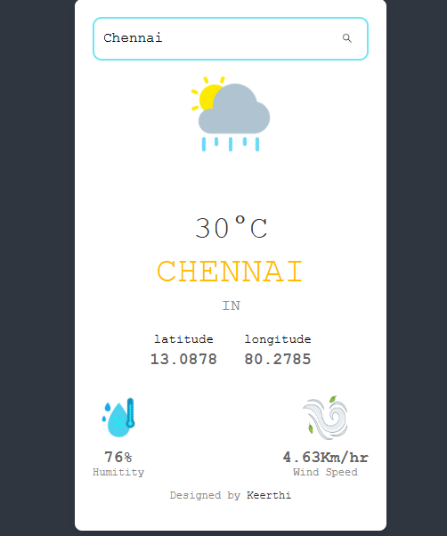

# Weather App

A simple and responsive Weather Application built using **React and Vite** that allows users to search for a city and view its current weather information.

## 🚀 Features

* Search weather by city name
* Displays current temperature
* Shows weather condition
* Displays humidity information
* Displays wind speed
* Responsive design
* Simple and user-friendly interface
* Dynamic weather icons and backgrounds

## 🛠️ Technologies Used

* React
* Vite
* JavaScript
* HTML
* CSS
* Weather API

## 📸 Project Preview



## 💻 Installation

Clone the repository:

```bash
git clone https://github.com/Keerthi1218/weather-app.git
```

Navigate to the project folder:

```bash
cd weather-app
```

Install dependencies:

```bash
npm install
```

Start the development server:

```bash
npm run dev
```

Open the local URL provided in the terminal.

## 📁 Project Structure

```text
weather-app/
├── src/
│   ├── assets/
│   ├── components/
│   ├── App.jsx
│   └── App.css
├── public/
├── weatherImage.png
├── package.json
├── package-lock.json
├── README.md
└── vite.config.js
```

## 🎯 Purpose

This project was created to practice **React fundamentals, API integration, state management, event handling, and responsive UI development**.

## 👨‍💻 Author

**Keerthika K**

---

⭐ If you like this project, feel free to give it a star!
